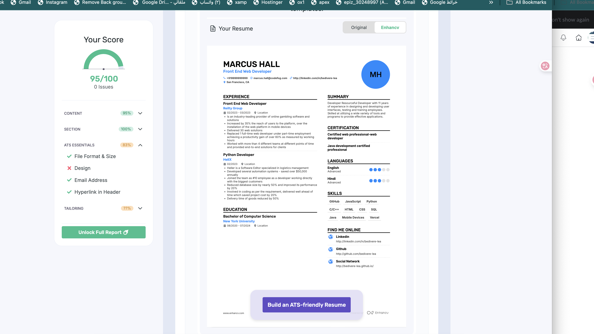
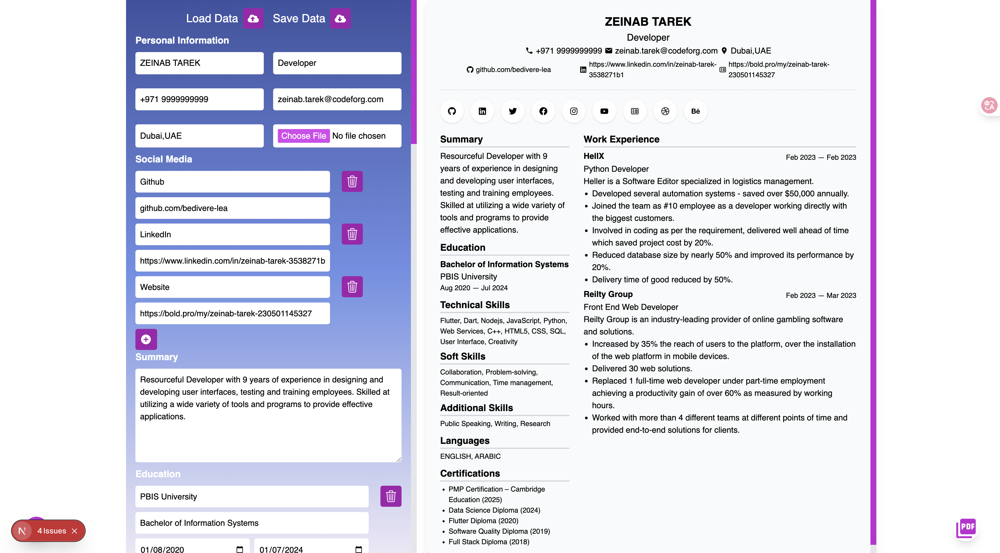

 
# 🧠 ATS Resume Builder

A **modern, ATS-optimized resume builder** built with **Next.js**, **React**, and **Tailwind CSS** — designed to help users create professional resumes that achieve **95%+ ATS (Applicant Tracking System) compatibility**.

This project automatically structures resume data in an **ATS-friendly format**, ensuring recruiters and automated systems can easily parse the content.

---

## 🖼️ Preview

| Resume Builder | ATS Score Result |
|----------------|------------------|
|  |  |

✅ *Screenshots showing real-time resume creation and an ATS score of **95/100** from [Enhancv Resume Checker](https://enhancv.com/resources/resume-checker/).*

---

## 🚀 Features

- 🧩 **Dynamic Resume Form** – Edit your resume data in real time with an intuitive form.  
- ⚡ **Live Preview** – Instantly see how your resume looks as you type.  
- 🧾 **ATS Optimization** – Structured sections and clean formatting improve ATS readability.  
- 🔄 **Drag & Drop Sections** – Reorder sections such as Work Experience, Projects, and Skills.  
- 💾 **Save & Load Data** – Save progress locally or reload existing data anytime.  
- 🖨️ **Print / Export PDF** – Download your resume directly with one click.  
- 🎨 **Responsive Design** – Built with TailwindCSS for modern, mobile-friendly UI.  
- 🧠 **Default Resume Template** – Includes sample data to help you get started quickly.  

---

## 🧰 Tech Stack

| Technology | Purpose |
|-------------|----------|
| **Next.js 15** | Server-side rendering, routing, and performance optimization |
| **React 18** | Component-based UI development |
| **Tailwind CSS 3** | Responsive styling and custom design |
| **TypeScript 5** | Type-safe development |
| **PostCSS + Autoprefixer** | CSS transformation and browser compatibility |
| **React Beautiful DnD** | Drag-and-drop functionality for reordering resume sections |
| **React Icons** | Clean and scalable icons |
| **React Highlight Menu** | Text highlighting and selection menu |
| **ESLint + Prettier** | Code quality and linting tools |

---

## 📁 Folder Structure

```

src/
├── app/
│   ├── layout.js           # Application layout
│   └── page.jsx            # Main resume builder page
├── components/
│   ├── form/               # Form inputs and data collection components
│   ├── hero/               # Intro or header section
│   ├── meta/               # SEO and metadata
│   ├── preview/            # Resume preview UI
│   └── utility/            # Helper functions (DateRange, WinPrint, builder, etc.)
├── hooks/
│   └── useKeyboardShortcut.js
├── styles/
│   └── globals.css
public/
└── assets/
├── 1st.png             # Resume Builder UI screenshot
└── 2nd.png             # Enhancv ATS score screenshot

````

---

## 📊 How This App Achieves **95%+ ATS Score**

This project was tested using [Enhancv Resume Checker](https://enhancv.com/resources/resume-checker/) and achieved a **score of 95/100**.

**Reasons for high ATS compatibility:**

1. 🧱 **Structured HTML hierarchy** for every resume section (Experience, Skills, Education, etc.)  
2. 🏷️ **Semantic headings (`<h2>`, `<h3>`)** improve parsing by Applicant Tracking Systems  
3. 🧾 **Minimal use of images/tables**, ensuring clean text extraction  
4. 🔍 **Consistent section naming** — matches ATS keyword patterns (e.g., “Work Experience”, “Education”, “Skills”)  
5. 📄 **PDF output from structured DOM**, not images, ensuring full text readability  
6. 🧠 **Keyword-rich templates** aligned with top-performing resumes  
7. ✍️ **ATS-safe fonts & minimal styling** for parsing accuracy across readers  

---

## 🧾 Resume Sections

- **Personal Information** – Name, email, phone, address, and profile photo  
- **Social Media** – Links to GitHub, LinkedIn, and portfolio sites  
- **Summary** – Professional overview or objective statement  
- **Education** – Institution, degree, start and end dates  
- **Work Experience** – Companies, roles, achievements, and project impact  
- **Projects** – Key personal or professional projects  
- **Technical Skills** – Programming languages, frameworks, tools  
- **Soft Skills** – Communication, leadership, problem-solving, etc.  
- **Languages** – Spoken and written languages  
- **Certifications** – Relevant certifications and completion years  

---

## 🛠️ Installation & Usage

```bash
# Clone the repository
git clone https://github.com/zeinabtarek/atsresume.git

# Navigate to the project directory
cd atsresume

# Install dependencies
yarn install
# or
npm install

# Run in development mode
yarn dev
# or
npm run dev

# Visit the app in your browser
http://localhost:3000
````

---

## 🧩 Change Log

* Added **drag and drop** functionality for reordering resume sections
* Improved **ATS structure** and **section parsing**
* Integrated **real-time live preview**
* Added **PDF export and local data saving**

---

## 🎯 Goal

The main goal of **ATS Resume Builder** is to help job seekers and developers **create resumes that are both visually appealing and highly ATS-compliant**, increasing visibility and interview chances.

---

## 🌍 Deployment

You can easily deploy the project using:

### ▶️ **Vercel (Recommended)**

```bash
vercel
```

### 🌐 **Netlify**

```bash
netlify deploy
```

---

## 📬 Feedback

If you find this project useful, please ⭐ **star this repository** and share your thoughts!
Contributions, PRs, and ideas are always welcome.

---

### 👩‍💻 Built & Maintained by **Zeinab Tarek**

📧 [zeinab.tarek@codeforg.com](mailto:zeinab.tarek@codeforg.com)
🌍 [https://bold.pro/my/zeinab-tarek-230501145327](https://bold.pro/my/zeinab-tarek-230501145327)
🐙 [GitHub](https://github.com/zeinabtareek)
💼 [LinkedIn](https://www.linkedin.com/in/zeinab-tarek-3538271b)
 